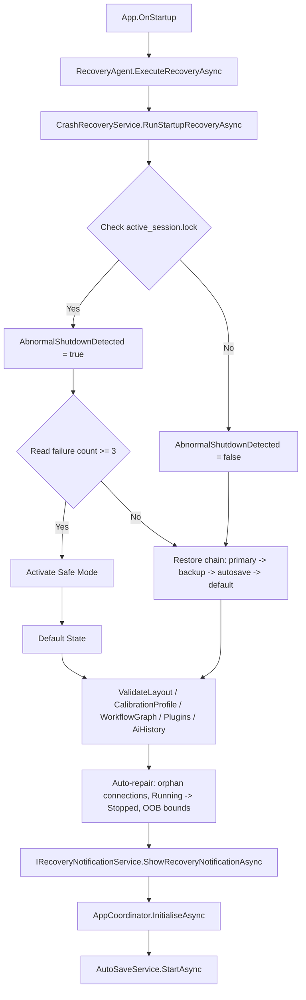
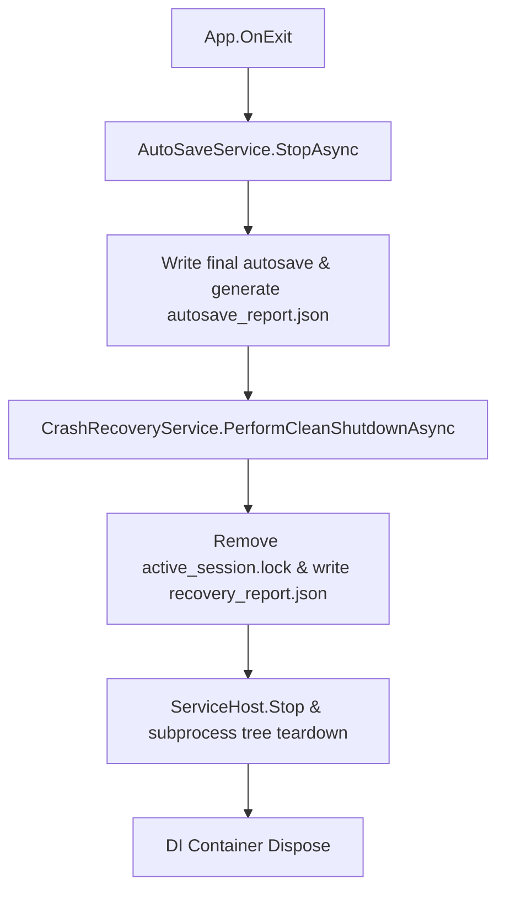

# AirGesture AI v4.1.0 — Architectural Specification

This document provides a detailed overview of the system architecture of AirGesture AI v4.1.0. The platform is designed as an offline-first, high-performance, and secure gesture control system featuring process isolation, asynchronous named pipe IPC, local neural inference, agentic task orchestration, and production-grade crash recovery.

```
                  ┌──────────────────────────────────────────────┐
                  │                 MainWindow UI                │
                  └──────────────────────┬───────────────────────┘
                                         │ (Direct Method Calls)
                                         ▼
                  ┌──────────────────────────────────────────────┐
                  │                 AppCoordinator               │
                  └──────────────────────┬───────────────────────┘
                                         │
                 ┌───────────────────────┴───────────────────────┐
                 ▼                                               ▼
     ┌───────────────────────┐                       ┌───────────────────────┐
     │     TrackerBridge     │                       │     AIWorkerBridge    │
     └───────────┬───────────┘                       └───────────┬───────────┘
                 │ (Named Pipe IPC)                              │ (Named Pipe IPC)
                 ▼                                               ▼
     ┌───────────────────────┐                       ┌───────────────────────┐
     │      TrackerHost      │                       │      AIWorkerHost     │
     │  (Python/MediaPipe)   │                       │   (ONNX Runtime C#)   │
     └───────────────────────┘                       └───────────────────────┘
```

---

## 1. Process Isolation & Multi-Process Lifecycle

To prevent long-running Python model runtime dependencies and camera acquisition errors from blocking or crashing the primary user interface thread, AirGesture AI v4.0.0 implements strict **Process Isolation**.

### Lifecycle Management
- **ServiceHost**: The orchestrator in the main process that monitors subprocess lifecycles.
- **ServiceProcessManager**: Launches the same executable with distinct CLI arguments (`--tracker-host` and `--ai-worker`) to start background subprocess hosts.
- If a background subprocess crashes, the ServiceProcessManager detects the exit and performs automatic recovery.
- Upon main application exit, all subprocesses are cleanly killed using recursive process tree termination (`Process.Kill(true)`).

---

## 2. Secure Named Pipe IPC Channel

Data exchanges between the main application and isolated subprocesses are executed over **Windows Named Pipes** using a lightweight JSON protocol.

- **IpcMessage**: Standard envelope format holding `Method`, `Payload`, and a secure verification `Token`.
- **IpcSerializer**: Encodes/decodes messages using `System.Text.Json` to ensure robust escaping of Base64 buffers and nested JSON payloads.
- **IpcServer / IpcClient**: Manages asynchronous, non-blocking reading and writing to pipes with connection timeouts (2000 ms).
- **IpcSecurity**: Enforces pipe security by validating authentication tokens (`SECURE_AIRGESTURE_TOKEN_v4`) to block unauthorized cross-process calls.

---

## 3. Computer Vision & MediaPipe Hand Tracking

- **OpenCvCameraProvider**: Connects to system webcams using DirectShow (`VideoCaptureAPIs.DSHOW`), capturing raw frames at `640x480` at 30 FPS.
- **TrackerBridge**: Converts OpenCV matrices (`Mat`) to Base64 JPEG byte streams and transfers them across the Named Pipe to the `TrackerHost` subprocess.
- **TrackerHost / PythonHandTracker**: The subprocess receives frames, decodes them, and processes them through an offline Python MediaPipe Hand Tracking model. Landmark coordinates (21 points, XYZ) are sent back to the main process as a structured JSON object.

---

## 4. Local Neural Inference (ONNX Runtime)

To classify complex gesture patterns and intents offline, the system relies on native hardware acceleration:

- **AIWorkerHost**: Serves as the inference execution endpoint.
- **ModelExecutionHost**: Loads neural networks inside the Microsoft ONNX Runtime environment.
- **Execution Providers**: Automatically detects and leverages GPU acceleration. Attempts loading **DirectML** first, followed by **CUDA** (NVIDIA), with a graceful fallback to multi-threaded **CPU** inference.

---

## 5. Agentic Orchestration (DAG Planner)

The system parses user goals and complex control requests using an autonomous agent runtime:

- **SemanticIntentEngine**: Uses character-hashed word embeddings and cosine similarity to map natural language commands to specific system intents (e.g. `OpenApplication`, `SwitchWorkspace`).
- **AgentOrchestrator**: Submits resolved intents to the agent runtime.
- **DagPlanner**: Decomposes goals into a Directed Acyclic Graph (DAG) using Kahn's topological sort. Tiers of independent agent tasks are executed concurrently in parallel, while sequential dependencies are strictly enforced.
- **Robust Execution**: Tasks are automatically retried up to 3 times with exponential back-off (`baseDelay * 2^attempt`) and respond to global cooperative cancellation tokens.

---

## 6. Enterprise Logging Pipeline

To ensure diagnostic traceability and prevent logging I/O from impacting frame processing pipelines or UI thread frame rates, AirGesture AI v4.1 RTM incorporates an asynchronous, structured enterprise logging pipeline.

```
  Caller (Main/Subprocess Thread)
             │
             ▼ Logger.Info() / LoggingService.Information()
   ┌────────────────────────────────────────────────────────┐
   │           Channel<LogEntry> (Async Queue)              │
   └─────────────────────────┬──────────────────────────────┘
                             │
                             ▼ (Background task thread drain)
   ┌────────────────────────────────────────────────────────┐
   │         Daily Rolling & Size-Based Log Rotations       │
   └─────────────────────────┬──────────────────────────────┘
                             │
                             ▼ (Log archiving / Compression)
   ┌────────────────────────────────────────────────────────┐
   │             airgesture_YYYYMMDD_N.log.gz               │
   └────────────────────────────────────────────────────────┘
```

- **LoggingService**: Thread-safe central service utilizing `System.Threading.Channels.Channel<LogEntry>` with bounded capacity. This eliminates synchronous file locks and avoids I/O bottlenecks.
- **Asynchronous Processing**: A dedicated background consumer thread drains the channel, serialization-formats each entry as a structured JSON line, and handles daily and size-based rotation.
- **Rolling Policies**: Logs roll over automatically at midnight (UTC) or when file size thresholds are exceeded. Obsolete log files are pruned based on configured retention limits.
- **Archiving & Compression**: Old daily files are automatically compressed using GZip stream compression into `.log.gz` archives in a background task to conserve local disk space.
- **Subscribers**: Wires live broadcasts to UI subscribers or debug consoles dynamically.
- **Logger Bridge**: Bridges legacy `Logger.Info` style static calls to the DI-injected structured `LoggingService` cleanly.

---

## 7. Asynchronous IPC Flow

```
   Client Thread (e.g. TrackerBridge)
                  │
                  ▼ SendAsync()
   ┌────────────────────────────────────────────────────────┐
   │     NamedPipeClientStream.ConnectAsync() (Timeout-safe)│
   └──────────────────────┬─────────────────────────────────┘
                          │
                          ▼ (Asynchronous Write)
   ┌────────────────────────────────────────────────────────┐
   │             ReadAsync() Await Response                 │
   └──────────────────────┬─────────────────────────────────┘
                          │ (Named Pipe Byte Stream)
                          ▼
   ┌────────────────────────────────────────────────────────┐
   │     WaitForConnectionAsync() -> ProcessConnection()    │
   └──────────────────────┬─────────────────────────────────┘
                          │ (Background Thread Execution)
                          ▼
   ┌────────────────────────────────────────────────────────┐
   │          RouteAsync() -> Execute Middleware            │
   └────────────────────────────────────────────────────────┘
                 Server Listener Task
```

- **Async Client/Server**: Connections are established non-blockingly using `WaitForConnectionAsync` and `ConnectAsync`. Reads and writes use `ReadAsync` and `WriteAsync`.
- **Concurrent Processing**: The server loop spans individual connection processing tasks (`Task.Run`) to handle multiple concurrent clients simultaneously.
- **Correlation ID Tracking**: `CorrelationId` is generated or propagated for every request, allowing exact request-response tracing in asynchronous environments.
- **Request Timeouts**: A linked `CancellationTokenSource` automatically cancels client waits if a response is not received within `RequestTimeoutMs`.

---

## 8. Optimized Startup Pipeline & Lazy Loading

To achieve a cold startup latency of under 2 seconds, AirGesture AI v4.1 RTM defer-initializes all heavy dependencies until after the main UI window is rendered and becomes responsive.

```
  1. Initialize Logging
            │
            ▼
  2. Load App Configuration
            │
            ▼
  3. Configure Services (DI Registrations)
            │
            ▼
  4. Instantiate MainWindow (Lazy Service Resolutions)
            │
            ▼
  5. MainWindow.Show() (UI Responsive)
            │
            ▼ (Background Thread Execution via PerformanceOptimizer)
  6. Deferred Background Initializations
       ├── OnnxRuntimeEngine.Initialize() (AI Models Load)
       ├── ServiceHost.Start() (Subprocesses Spawns)
       ├── EnterpriseSecurityCenter.Initialize()
       ├── AgentOrchestrator.Start()
       └── StartupProfiler.FinalizeProfile() -> startup_report.json
```

- **Deferred Load**: heavy subsystems (ONNX Model session creation, subprocess host spawning, etc.) are scheduled as background tasks on the ThreadPool using `PerformanceOptimizer.ScheduleBackgroundTask`.
- **Startup Diagnostics**: `StartupProfiler` compiles phase-specific load latencies (DI container build, window instantiation, model initialization) and generates `startup_report.json` upon completion of the startup sequence.
- **Performance Optimizer**: Tunes thread pool minimum worker threads for high concurrency, monitors memory footprint, and executes garbage collection/cache trimming if memory exceeds the 250MB threshold.

---

## 9. Security Hardening Architecture

### 9.1 SecureVault Key Hierarchy

```
  Windows DPAPI (CurrentUser)
         │ protects
         ▼
  .master.key  (256-bit AES random key)
         │ key material for
         ▼
  AES-256-GCM per-entry encryption
   [12B nonce | 16B tag | ciphertext]
         │ stored as
         ▼
  SecureVault\<sanitized-name>.vault   (Base64)
         │ copied to
         ▼
  SecureVault_backup\<name>.vault  (for recovery)
```

### 9.2 IPC Security Middleware Pipeline

```
  Incoming Named Pipe Packet
          │
          ▼
  ┌──────────────────────────────────────┐
  │  UseSecurityMiddleware()             │
  │                                      │
  │  ① IpcSecurity.ValidateToken()      │ ← REJECT if invalid
  │     OnAuthFailure?.Invoke()          │   (logged + RTS counter++)
  │                                      │
  │  ② InputSecurity.Validate(Payload)  │ ← REJECT if injection chars
  │                                      │
  │  ③ next(msg, ct) → handler          │
  │                                      │
  │  ④ Audit log AUDIT=OK               │
  └──────────────────────────────────────┘
          │
          ▼
  Handler Response → Client
```

### 9.3 Runtime Protection Monitor Loop

```
  [Every 30 seconds — Background Task]
          │
          ├── CheckBinaryModification()
          │     SHA-256(AirGestureAI.exe) vs baseline hash
          │     → WARNING if changed
          │
          ├── CheckVaultCorruption()
          │     Base64.FromBase64String() on all *.vault files
          │     → WARNING if any fail + flag set
          │
          └── CheckConfigurationValidity()
                JsonDocument.Parse(config.json)
                → WARNING if malformed
```

### 9.4 Security Audit Check Flow

```
  SecurityAuditService.RunAuditAsync()
          │
          ├── BinaryIntegrity          (SHA-256 vs sidecar)
          ├── UnsignedPluginDetection  (Zone inspection on .dll)
          ├── ConfigurationValidation  (JSON parse check)
          ├── VaultIntegrity           (Base64 blob check)
          ├── IpcTokenValidation       (length + complexity)
          ├── FilePermissionValidation (AppData directory access)
          ├── PolicyValidation         (NetworkAccess must be blocked)
          └── PluginManifestValidation (name/version/author/assembly)
                    │
                    ▼
          Grade Computation (A–F)
                    │
                    ▼
          %LocalAppData%\AirGestureAI\Diagnostics\security_report.json
```

---

## 10. Diagnostics Architecture

### 10.1 Telemetry Gathering and Report Pipeline

```
  Telemetry Sources (Pipes, OpenCV, CPU, RAM, WPF Visual Tree)
                              │
                              ▼
  ┌───────────────────────────────────────────────────────┐
  │                 Telemetry Collectors                  │
  │                                                       │
  │  • PerformanceProfilerService (CPU/RAM/Latencies)     │
  │  • MemoryDiagnosticsService   (WeakReference registry)│
  │  • AccessibilityVerifierService (Visual Tree traversal)│
  │  • SystemDiagnosticsService   (WMI & Environment)     │
  │  • PluginDiagnosticsService   (LoadResults from PM)   │
  └───────────────────────────┬───────────────────────────┘
                              │
                              ▼
  ┌───────────────────────────────────────────────────────┐
  │                  DiagnosticsManager                   │
  │                                                       │
  │  • Runs a background scheduler task (every 30s)       │
  │  • Manages the export directory location              │
  │  • Handles cooperative task cancellation              │
  └───────────────────────────┬───────────────────────────┘
                              │ Writes JSON reports to
                              ▼
  %LocalAppData%\AirGestureAI\Diagnostics\
       ├── performance_report.json
       ├── memory_report.json
       ├── accessibility_report.json
       ├── system_report.json
       └── plugin_report.json
```

- **Thread Safety**: Snapshots and weak reference registries are protected using standard lock primitives, and high-frequency latencies use non-blocking thread-safe collections (`ConcurrentQueue<double>`).
- **Memory Audits**: Utilizes `WeakReference` wrappings to verify that resources (like OpenCV Mats, Bitmaps, Pipes, and Streams) are collected once discarded, checking `IsAlive` states to identify leaks.
- **Accessibility audits**: Walks the WPF Visual tree recursively on the UI thread dispatcher, checking for Automation IDs, Automation Names, Tab Indexes, Focus Visual Styles, and queries system accessibility parameters (contrast, screen readers, reduced motion).


---

## 11. Phase 5 — Crash Recovery & Session Restoration Subsystem

The Phase 5 recovery subsystem is a self-contained set of four services that form a safety net for unexpected application termination.

### Startup Sequence



### Shutdown Sequence



### Service Responsibilities

| Service | Responsibility |
|---------|---------------|
| `SessionStateManager` | Atomic writes, SHA-256 integrity, backup, checkpoints, v4.0 migration |
| `AutoSaveService` | Background dynamic Task.Delay, dirty flag, retry with backoff, diagnostics copy |
| `CrashRecoveryService` | Lock file, failure counter, Safe Mode, restore chain, recovery_report.json |
| `RecoveryAgent` | Component validation, repair, notification, validation_report.json |

### State File Integrity

All session state is wrapped in a `SessionEnvelope` with a SHA-256 checksum:

```
Disk File
  └─ SessionEnvelope { Version, Checksum, PayloadJson }
        └─ SessionState { WindowLayout, CalibrationProfile, WorkflowState, ... }
```

Writes are **atomic**: payload → temp file → File.Move (O_RENAME semantics).

### v4.0 Workflow Migration

```
v4.0 Workflow.Steps[]
    Step { Action, Target, Parameters, Status }
         ↓  automatic migration
v4.1 WorkflowState.Nodes[]
    WorkflowNodeState { Id, Label, Parameter, NodeType, CanvasX, CanvasY }
    WorkflowConnectionState { SourceId, TargetId }   (chained sequentially)
```

---

## Phase 6 — Production Integration & Application Lifecycle

Phase 6 wires the Phase 5 recovery subsystem into the real WPF application lifecycle inside `App.xaml.cs`.

### Service Registration (Milestone 2)

All recovery services are registered as **singletons** in `ConfigureServices`. Factory lambdas capture `appDataPath` from the method parameter:

```csharp
services.AddSingleton<SessionStateManager>(sp => new SessionStateManager(appDataPath, sp.GetRequiredService<LoggingService>()));
services.AddSingleton<CrashRecoveryService>(sp => new CrashRecoveryService(...));
services.AddSingleton<ISessionStateProvider, SessionStateProvider>();
services.AddSingleton<AutoSaveService>(sp => new AutoSaveService(...));
services.AddSingleton<IRecoveryNotificationService, WpfRecoveryNotificationService>();
services.AddSingleton<RecoveryAgent>(sp => new RecoveryAgent(...));
```

**Subprocess hosts bypass all recovery logic.** `--tracker-host` and `--ai-worker` modes return immediately before any DI setup.

### Startup Recovery Flow (Milestone 3)

Executed synchronously before `MainWindow` is shown, after the DI container is built:

```
DI Build complete
    ↓
RecoveryAgent.ExecuteRecoveryAsync()
    ├── CrashRecoveryService.RunStartupRecoveryAsync()  — detects lock file / restores state
    ├── Component validation + repair (layout, calibration, workflow, plugins, AI history)
    └── MarkStartupStableAsync()                        — resets failure counter
    ↓
ISessionStateProvider.ApplyStateAsync(recoveredState)  — applies state to live services + window
    ↓
App.RecoveryStatus populated (IsSafeMode, Source, Severity…)
    ↓
AutoSaveService.StartAsync(_appLifetimeCts.Token)       — background autosave loop begins
    ↓
MainWindow shown
```

### Normal Operation — Dirty Flagging (Milestone 4)

`AutoSaveService.MarkDirty()` should be called by any service or view-model that modifies recoverable state (camera index, preferences, workflow graph). The autosave loop (30-second interval by default) writes state only when the dirty flag is set.

### Graceful Shutdown (Milestone 5)

`OnExit` performs the following sequence:

```
_appLifetimeCts.Cancel()                   — stops AutoSave loop
AutoSaveService.StopAsync()                — drains any in-flight save
AutoSaveService.MarkDirty() + SaveNowAsync() — final state flush
CrashRecoveryService.DisposeAsync()        — removes active_session.lock (clean exit)
ServiceHost.Stop()                         — terminates subprocess tree
IDisposable.Dispose()                      — DI container cleanup
```

### Recovery Status (Milestone 9)

`App.RecoveryStatus` (type `RecoveryStatus`) is a read-only snapshot exposed on the static `App.Current` instance:

| Property | Description |
|---|---|
| `IsSafeMode` | Whether Safe Mode is active |
| `AbnormalShutdownDetected` | Whether a crash lock was found on startup |
| `RecoverySource` | `"None"` / `"Primary"` / `"Backup"` / `"Autosave"` / `"SafeMode"` |
| `ConsecutiveFailureCount` | Number of consecutive startup failures before this run |
| `LastValidationSeverity` | `"Healthy"` / `"Warning"` / `"Recoverable"` / `"Critical"` |
| `LastSuccessfulSaveTime` | UTC timestamp of last autosave, or `null` |
| `IsCleanStart` | `true` if no recovery events occurred |

### New Files Added (Phase 6)

| File | Purpose |
|---|---|
| `Services/SessionStateProvider.cs` | Concrete `ISessionStateProvider` — captures/applies state from live services and WPF window |
| `Services/RecoveryStatus.cs` | Read-only UI-facing snapshot of recovery state |
| `Services/WpfRecoveryNotificationService.cs` | WPF toast notification for crash detection events |
| `Tests/CrashRecoveryIntegrationTests.cs` | 14 end-to-end integration tests for the full lifecycle |
